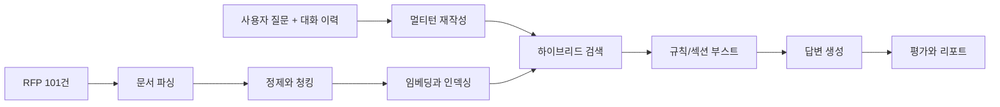

<div align="center">

# 📘 삼삼오오 RAG

**공공입찰 RFP를 빠르게 탐색하고 비교할 수 있도록 만든 Evidence-grounded RAG 시스템**

공공입찰 컨설턴트가 수백 페이지짜리 RFP에서 핵심 요구사항, 예산, 일정, 평가기준을 더 빠르게 파악할 수 있도록 설계한 질의응답 플랫폼입니다.


</div>

> **YAML 1장으로 실험을 정의하고, CLI 1줄로 실행하면 비용·메트릭·메타데이터가 자동 기록되며, 노션 친화 마크다운 리포트가 생성됩니다.**

## 🔗 Project Links

| 항목 | 링크 |
|---|---|
| 아키텍처 문서 | [`docs/architecture.md`](docs/architecture.md) |
| 프로젝트 구조 | [`docs/project-structure.md`](docs/project-structure.md) |
| 의사결정 기록 | [`docs/decision-log.md`](docs/decision-log.md) |
| 협업 규칙 | [`docs/collaboration/branch-strategy.md`](docs/collaboration/branch-strategy.md) |
| 발표 자료 | 추가 예정 |
| 시연 영상 | 추가 예정 |

## 🧭 Project Overview

### 1. Problem

공공입찰 RFP는 길고 복잡합니다. 컨설턴트는 수백 페이지 문서에서 요구사항, 자격요건, 평가기준, 예산, 일정 같은 핵심 정보를 빠르게 찾아야 하지만, 기존 업무는 대부분 수작업에 의존했습니다.

### 2. Goal

BidMate RAG는 공공입찰 RFP를 질문형으로 탐색하고, 문서 근거를 함께 제시하며, 여러 문서를 비교할 수 있는 실무형 RAG 도구를 만드는 것을 목표로 합니다.

### 3. Approach

- `멀티턴 재작성 + 하이브리드 검색 + 규칙/섹션 부스트`를 기본 운영 검색 경로로 사용합니다.
- `CLI 평가 도구 + Streamlit 디버깅 UI + Next.js 사용자 채팅 UI`를 함께 제공해 연구와 사용 경험을 모두 다룹니다.
- 검색 성능뿐 아니라 `Faithfulness`, `Answer Relevance`, `Context Precision`, `Context Recall`까지 함께 평가합니다.
- 평가셋 검증, 비용 추적, chunking 격리, stale chunk 방지 같은 신뢰성 장치를 기본으로 포함합니다.

## 📌 Project Summary

| 항목 | 내용 |
|---|---|
| 프로젝트명 | BidMate RAG |
| 목표 | 공공입찰 RFP를 근거 기반으로 탐색·비교·질의응답하는 시스템 구축 |
| 주요 사용자 | 입찰메이트 컨설팅 실무 컨설턴트 |
| 대상 문서 | 공공입찰 RFP 원본 문서 101건 |
| 문서 구성 | HWP 96건 / PDF 4건 / DOCX 1건 |
| 핵심 파이프라인 | 파싱 → 정제 → 청킹 → 인덱싱 → 검색 → 생성 → 평가 → 리포트 |
| 운영 시나리오 | 시나리오 A: 로컬 LLM / 시나리오 B: 상용 API LLM |
| 기본 검색 전략 | 멀티턴 재작성 + 하이브리드 검색 + 규칙/섹션 부스트 |
| 평가 방식 | 80문항 평가셋 + LLM-as-a-Judge 기반 다면 평가 |
| 산출물 | CLI 평가 도구 + Streamlit 디버깅 UI + Next.js 사용자 채팅 UI |
| 사용자 기능 | `@` 문서 멘션 + `/` 슬래시 커맨드 12종 + 근거 패널 |
| 협업 방식 | 시스템/데이터/검색·생성/평가/프론트엔드 역할 기반 분업 |

## 📊 Results

### KPI Snapshot

| 지표 | 결과 |
|---|---|
| 대상 문서 처리 | 101건 |
| 평가셋 규모 | 80문항 |
| MRR | 0.988 |
| Latency | 5.3초 (`Top-K=5`) |
| Cost per Query | `$0.001` (`Top-K=5`) |
| 기본 사용자 인터페이스 | Next.js + FastAPI |
| 팀 디버깅 인터페이스 | Streamlit 3탭 UI |

### What We Improved

| Baseline 한계 | 개선 방식 |
|---|---|
| 후속 질문에서 대명사 맥락이 끊김 | 멀티턴 재작성으로 독립 검색 쿼리 복원 |
| 숫자·고유명사·정확 키워드 검색이 약함 | Dense + Sparse를 결합한 하이브리드 검색 적용 |
| 질문과 무관한 청크가 상위에 노출됨 | 규칙 기반 부스트와 섹션 단서 활용 |
| 평가/실험 결과 추적이 어려움 | 비용·토큰·Latency·Git·설정 스냅샷 자동 기록 |
| 데이터 품질 문제로 침묵 실패 발생 가능 | 평가셋 검증, metadata 정합성 관리, stale chunk 방지 |

### Why This Matters

- 제한된 자원 환경 때문에 `Cross-Encoder`를 기본 운영 경로에 넣지 않았습니다.
- 대신 `하이브리드 검색 + 규칙/섹션 부스트`를 고도화해 더 가벼운 비용으로 검색 품질을 끌어올렸습니다.
- 결과적으로 `실사용 가능한 속도`, `낮은 질의 비용`, `재현 가능한 평가 흐름`을 함께 확보했습니다.

## 🧪 Experiment Demo

### 1. User Demo

> 📷 이미지 추가 예정
>
> 문서 카탈로그에서 RFP를 선택하고, `@` 멘션과 `/요약`, `/요구사항`, `/예산`, `/비교` 같은 슬래시 커맨드로 질문한 뒤, 우측 근거 패널에서 출처를 함께 확인하는 흐름을 여기에 배치할 예정입니다.

### 2. Evaluation Demo

> 📷 이미지 추가 예정
>
> `bidmate-eval` 실행 후 검색 메트릭, 생성 품질, 비용, Latency, Judge 결과가 자동으로 기록되고 마크다운 리포트로 이어지는 흐름을 여기에 배치할 예정입니다.

### 3. Pipeline Demo

> 📷 이미지 추가 예정
>
> YAML 실험 설정부터 인덱싱, 검색, 생성, 비교 리포트까지 이어지는 전체 실험 파이프라인을 한 장으로 요약한 화면을 여기에 배치할 예정입니다.

## 🤝 Team & Contributions

| 역할 | 주요 기여 |
|---|---|
| 시스템 아키텍처 | 전체 파이프라인 설계, 모듈 인터페이스 정의, 의사결정 정리 |
| 데이터 엔지니어링 | HWP/PDF 파싱, 텍스트 정제, 청킹 전략, 메타데이터 보정 |
| 검색·생성 | 멀티턴 재작성, 하이브리드 검색, 부스트 전략, 프롬프트 엔지니어링 |
| 평가·QA | 80문항 평가셋, LLM Judge, 벤치마크 자동화, 리포트 검증 |
| 프론트엔드·백엔드 | Next.js 사용자 UI, Streamlit 디버깅 UI, FastAPI 연동 |

## 🚀 Quick Start

### Option A. 바로 실행하기

현재 작업 저장소에는 `data/processed/*.parquet`와 `artifacts/chroma_db/`가 이미 존재하므로, 빠른 확인 목적이라면 아래 순서로 바로 실행할 수 있습니다.

```bash
# 1. 환경 셋업
uv sync --group dev
cp .env.example .env  # Windows PowerShell: Copy-Item .env.example .env

# 2. 환경 검증
uv run pytest tests/

# 3. 단일 RAG 쿼리
uv run python scripts/run_rag.py \
    --question "국민연금공단 이러닝 사업 요구사항" \
    --provider-config configs/providers/openai_gpt5mini.yaml

# 4. 평가 1회 실행
uv run bidmate-eval \
    --evaluation-path data/eval/eval_v1/eval_batch_01.csv \
    --provider-config configs/providers/openai_gpt5mini.yaml \
    --experiment-config configs/experiments/generation_compare.yaml \
    --limit 3 --skip-judge
```

### Option B. 원본 문서부터 다시 구축하기

원본 RFP 문서로부터 전체 파이프라인을 다시 만들고 싶다면 `파싱 → 정제 → 청킹 → 임베딩/인덱싱` 단계를 먼저 거쳐야 합니다.

```bash
# 1. 원본 문서 파싱/정제/청킹
uv run python scripts/ingest_data.py

# 2. chunks.parquet를 벡터 인덱스로 빌드
uv run python scripts/build_index.py \
    --provider-config configs/providers/openai_gpt5mini.yaml \
    --chunks-path data/processed/chunks.parquet

# 3. 단일 RAG 질의 실행
uv run python scripts/run_rag.py \
    --question "국민연금공단 이러닝 사업 요구사항" \
    --provider-config configs/providers/openai_gpt5mini.yaml
```

### Quick Start Notes

- `scripts/run_rag.py`는 **청킹을 자동으로 하지 않습니다**.
- 다만 Chroma 컬렉션이 비어 있고 `data/processed/chunks.parquet`가 존재하면, 런타임에서 인덱스를 자동으로 한 번 빌드합니다.
- 즉 `원본 문서만 있고 chunks.parquet가 없는 상태`라면 먼저 `scripts/ingest_data.py`를 실행해야 합니다.
- 전체 실험을 한 번에 돌리고 싶다면 `scripts/run_experiment.py`가 `ingest → build_index → eval → report`를 순차 실행합니다.

선택 설치:

```bash
uv sync --group dev --group ui   # Streamlit UI
uv sync --group dev --group ml   # 로컬 ML/PEFT 실험
```

## 🛠 Key Commands

| 목적 | 명령 |
|---|---|
| 단일 질의 실행 | `uv run python scripts/run_rag.py --question "..." --provider-config ...` |
| 단일 평가 실행 | `uv run bidmate-eval --evaluation-path ... --provider-config ... --experiment-config ...` |
| 전체 실험 실행 | `uv run python scripts/run_experiment.py --experiment-config configs/experiments/<name>.yaml` |
| 리포트 재생성 | `uv run bidmate-report --run-id bench-XXXXXXXX` |
| 여러 run 비교 | `uv run bidmate-compare --experiment <name>` 또는 `--run-ids ...` |
| 인덱스만 빌드 | `uv run python scripts/build_index.py --provider-config ... --chunks-path ...` |
| Streamlit 디버깅 UI | `PYTHONPATH=. uv run streamlit run app/main.py --server.port 8501 --server.address 0.0.0.0` |
| 사용자용 웹 UI | `./scripts/run_web.sh` |

### Next.js + FastAPI User UI

- 실제 컨설턴트가 사용하는 채팅 인터페이스입니다.
- `@` 문서 멘션, `/` 슬래시 커맨드 12종, 근거 패널, 문서 미리보기, 전체 카탈로그 탐색을 지원합니다.
- 기본 실행 후 `http://localhost:3000`에서 사용자 UI, `http://localhost:8100/docs`에서 FastAPI 문서를 확인할 수 있습니다.

## 🏗 Architecture



### 운영 경로

`멀티턴 재작성 -> 하이브리드 검색 -> 규칙/섹션 부스트 -> 생성`

### 설계 포인트

- 기본 운영 경로는 `Dense + Sparse` 결합형 검색을 사용합니다.
- `Cross-Encoder`는 비교용·실험용 경로로만 검토되었고, 제한된 자원 환경 때문에 기본 운영 경로에는 포함하지 않았습니다.
- 자세한 구조는 [`docs/architecture.md`](docs/architecture.md)에서 확인할 수 있습니다.

## ✅ Evaluation & Reliability

| 영역 | 내용 |
|---|---|
| 검색 평가 | `Hit Rate@5`, `MRR`, `nDCG@5` |
| 생성 평가 | `Faithfulness`, `Answer Relevance`, `Context Precision`, `Context Recall` |
| 운영 추적 | 비용, 토큰, Latency, Git 해시, 설정 스냅샷, 마크다운 리포트 자동 기록 |
| 평가셋 검증 | 샘플 로딩 직후 형식 및 metadata_filter 정합성 검사 |
| Chunking 격리 | `mode=full_rag` 실험에서 collection을 분리해 실험 간 오염 방지 |
| Stale chunk 방지 | 인덱스 재구축 시 이전 청크 잔존 데이터 제거 |
| 비교 분석 | `bidmate-compare`로 여러 run의 메트릭과 best/worst 결과 비교 |

## 📚 Project Docs

- [`docs/project-structure.md`](docs/project-structure.md): 저장소 구조 가이드
- [`docs/architecture.md`](docs/architecture.md): 파이프라인 구조와 설계 배경
- [`docs/decision-log.md`](docs/decision-log.md): 실험 및 기술 의사결정 기록
- [`docs/collaboration/branch-strategy.md`](docs/collaboration/branch-strategy.md): 브랜치 전략
- [`docs/collaboration/git-worktree-workflow.md`](docs/collaboration/git-worktree-workflow.md): worktree 협업 워크플로우
- [`CLAUDE.md`](CLAUDE.md): 프로젝트 협업 가이드

## 🗂 Project Structure

```text
src/bidmate_rag/
├── loaders/         # 문서 파싱
├── preprocessing/   # cleaner + chunker
├── providers/       # 임베딩 + LLM
├── retrieval/       # retriever + filters
├── evaluation/      # metrics + judge + benchmark
├── tracking/        # pricing + report + comparison
├── pipelines/       # ingest + build_index + chat
└── config/          # settings + prompts

app/                 # Streamlit UI
web/                 # Next.js 사용자 UI
configs/             # provider / experiment / pricing 설정
data/eval/eval_v1/   # 평가셋
artifacts/           # logs / reports
```

## ⚠ Notes

- API 키는 `.env`에서 관리하며 절대 커밋하지 않습니다.
- 원본 RFP 문서는 비공개 데이터이므로 저장소에 포함하지 않습니다.
- 일부 스크립트는 프로젝트 루트 기준 경로를 사용하므로 루트에서 실행하는 것을 권장합니다.

## 🔭 Future Work

- README용 데모 이미지와 GIF 추가
- 공개 가능한 샘플 데이터 기반의 외부 시연 버전 정리
- 멀티턴 슬롯 메모리와 숫자/단위 검색 정밀도 강화
- 시나리오 A 로컬 LLM 품질 개선과 배포 전략 구체화
