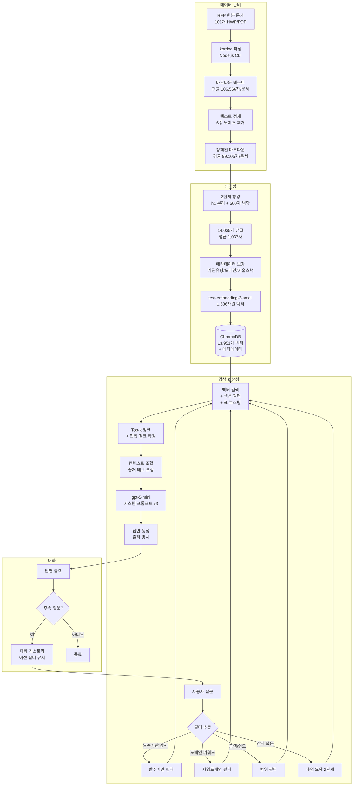
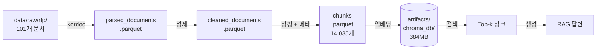
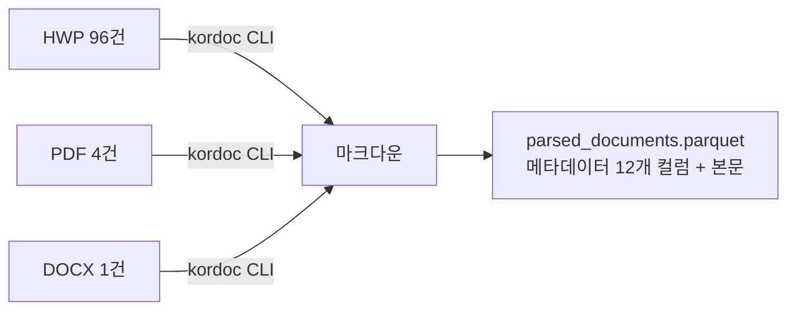
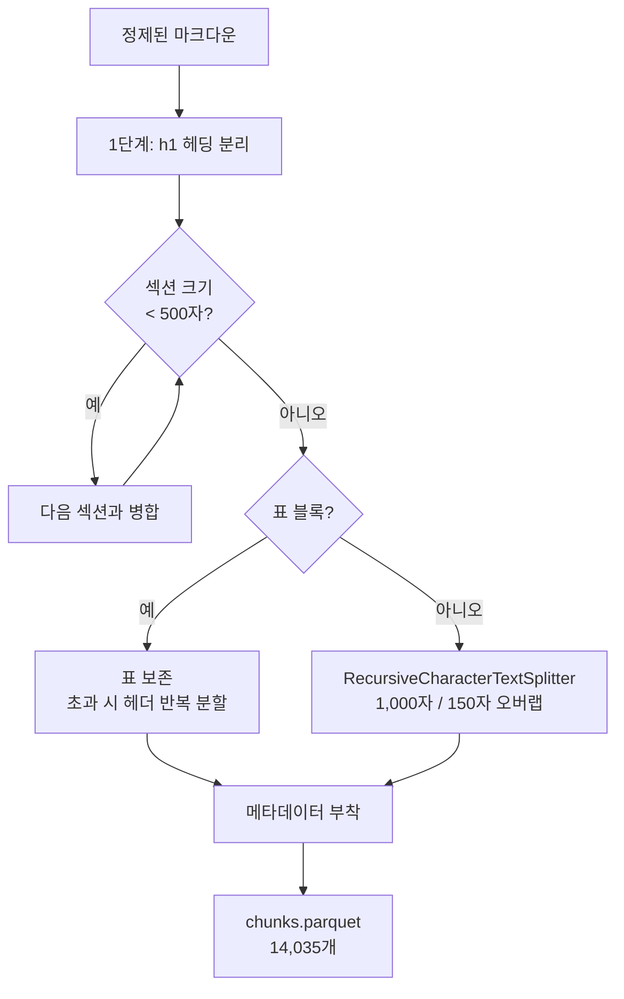
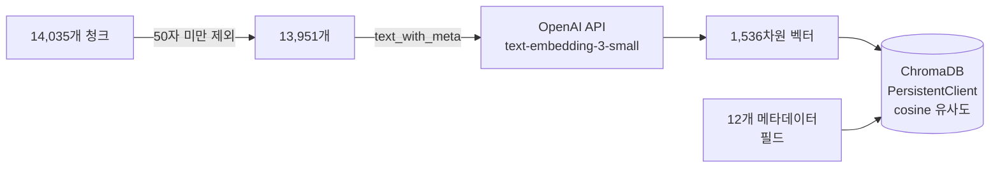
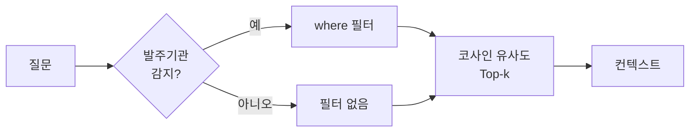
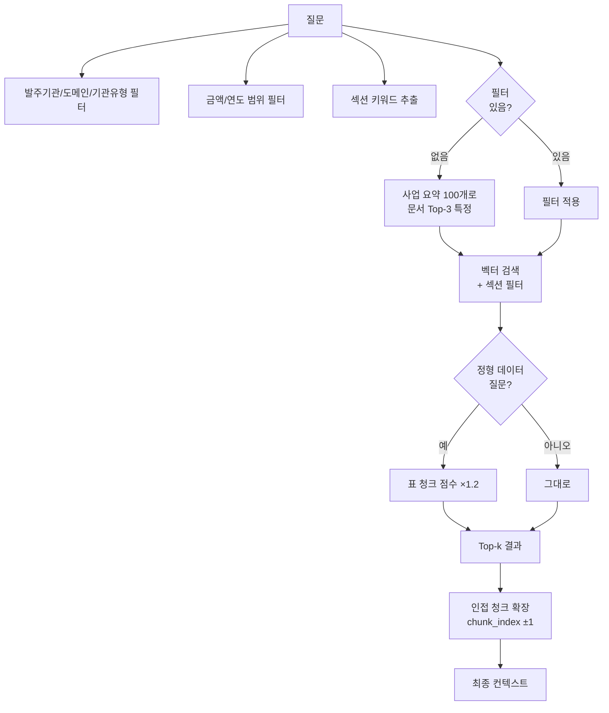
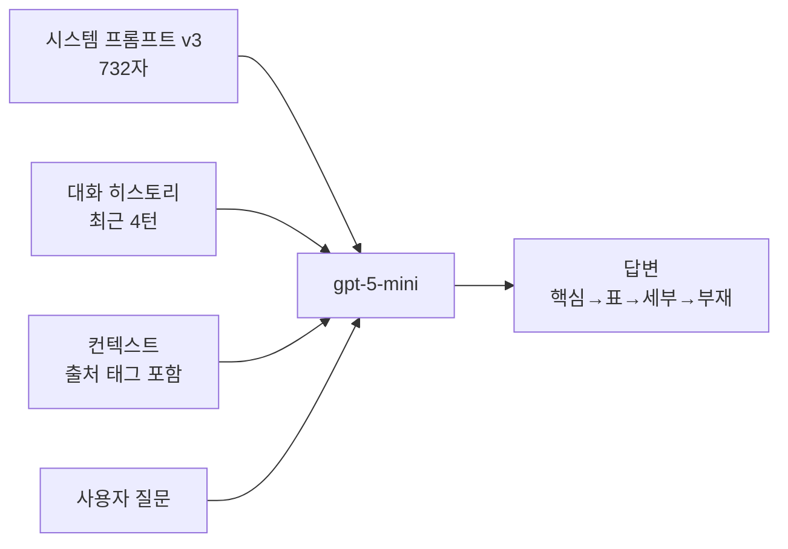
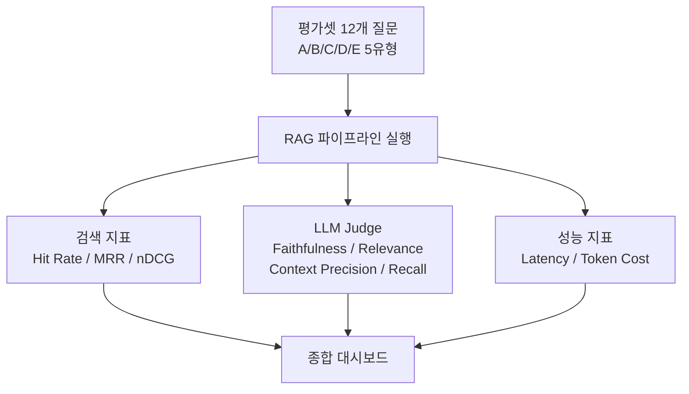

# Architecture — BidMate RAG Baseline (시나리오 B)

## 전체 파이프라인

## 데이터 흐름

## 주요 컴포넌트 상세

### 1. 파싱 (02_preprocessing)

- **파서**: kordoc (Node.js) — subprocess로 호출
- **출력**: 마크다운 (# 헤딩, 표, 목차 구조 보존)
- **성능**: 파일당 0.9초, CSV 대비 평균 28배 텍스트 추출
- **폴백**: hwp-hwpx-parser (Python) — kordoc 실패 시 교차 검증

### 2. 정제 (03_cleaning)

| 노이즈 | 제거량 | 제거율 |
|---|---|---|
| ` ` 태그 | 102,922개 | 100% |
| 연속줄바꿈 | 26,437개 | 100% |
| PUA 문자 | 2,831개 | 100% |
| 중복 셀 행 | 6,583개 | 99.6% |
| 연속공백 | 136,475개 | 27.6% (표 내부 보존) |

### 3. 청킹 (04_chunking)

**메타데이터 스키마**:

| 필드 | 출처 | 용도 |
|---|---|---|
| 사업명, 발주기관, 공고번호 | CSV 원본 | 출처 표시, 필터링 |
| 사업금액 | CSV 원본 | 금액 범위 필터 |
| 기관유형 | 규칙 분류 (v2) | "대학교 사업만" 필터 |
| 사업도메인 | 사업명 + 본문 키워드 | "교육 관련" 필터 |
| 기술스택 | 본문 키워드 | "AI 관련" 필터 |
| 공개연도 | 공개일자 변환 | "2024년" 필터 |
| section | 청킹 시 헤딩 | 섹션 필터 |
| content_type | 표/텍스트 구분 | 표 부스팅 |
| text_with_meta | 프리픽스 + 본문 | 임베딩 입력 |

### 4. 임베딩 + 벡터 DB (05_embedding)

- **임베딩 입력**: `[발주기관: X | 사업명: Y]\n본문...` (프리픽스 ~5%)
- **비용**: ~$0.15 (207원)
- **저장 크기**: 384MB

### 5. 검색 (06_retrieval, 07_generation)

#### Naive Baseline

#### Enhanced (5가지 고도화)

| 개선 | 효과 (비교 테스트) |
|---|---|
| 사업도메인 필터 | "교육 관련" → 교육/학습 4건 정확 검색 |
| 금액 범위 필터 | "5억 이상" → Naive 1건 → Enhanced **3건** |
| 섹션 필터 | 요구사항 질문에 요구사항 섹션 청크 우선 |
| 표 부스팅 | 정형 데이터 질문에 표 청크 상위 노출 |
| 인접 청크 | 잘린 표/문단의 뒷부분 보완 |

### 6. 생성 (07_generation)

**시스템 프롬프트 핵심 지시**:
- "추측하지 마세요" — 할루시네이션 방지
- "부분 확인 시 구분" — 있는 것과 없는 것 명시
- "다문서 비교: 하나의 표로 간결하게" — 토큰 효율
- "핵심 먼저, 세부 나중" — 일관된 구조

### 7. 평가 (08_evaluation)

**Baseline 평가 결과**:

| 지표 | 점수 |
|---|---|
| Hit Rate@5 (필터) | 1.00 |
| Hit Rate@5 (벡터만) | 0.78 |
| MRR (필터) | 1.00 |
| nDCG@5 (필터) | 1.00 |
| Faithfulness | 71점 |
| Relevance | 100점 |
| Context Precision | 88점 |
| Context Recall | 79점 |
| 무응답 정확도 | 100% |
| 평균 응답 시간 | 25.1초 |

## 기술 스택

| 구분 | 기술 | 용도 |
|---|---|---|
| 파싱 | kordoc (Node.js) | HWP/PDF → 마크다운 |
| 청킹 | LangChain MarkdownHeaderTextSplitter + RecursiveCharacterTextSplitter | 2단계 하이브리드 |
| 임베딩 | text-embedding-3-small (OpenAI) | 1,536차원 벡터 |
| 벡터 DB | ChromaDB (PersistentClient) | 코사인 유사도 + 메타 필터 |
| LLM | gpt-5-mini (OpenAI) | 답변 생성 + LLM Judge |
| 언어 | Python 3.12 + uv | 패키지 관리 |
| 실험 | Jupyter Notebook | 01~08 파이프라인 |

## 비용

| 항목 | 비용 |
|---|---|
| 전체 임베딩 (13,951개) | ~$0.15 (207원) |
| 질문 1건 (생성) | ~$0.001 (1원) |
| 평가 12건 (생성+Judge) | ~$0.10 (135원) |
| **총 1회 실행** | **~$0.25 (340원)** |
